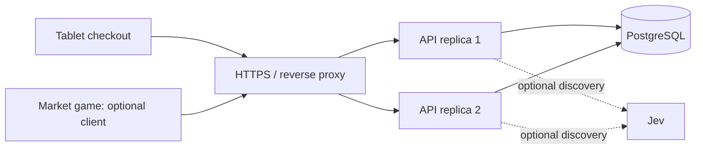
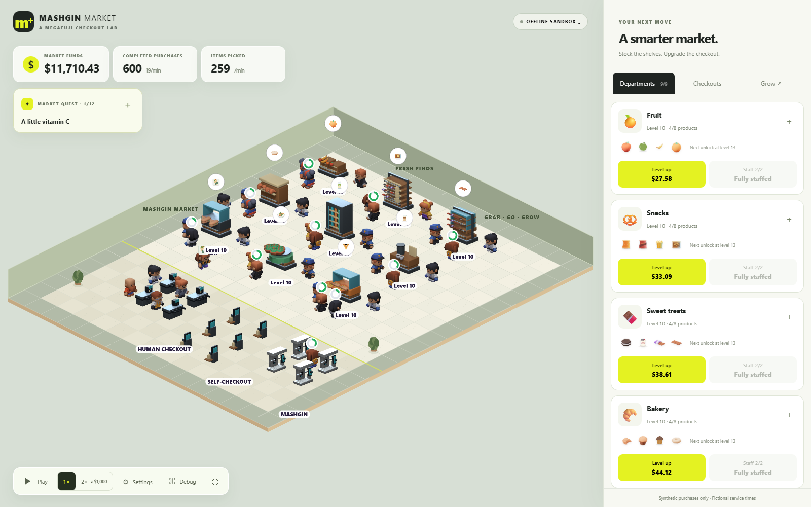

# Mashgin Market — Checkout

### A small market with a checkout you can trust.

Browse **76 products in nine categories**, find something with instant search or optional Jev suggestions, place a fictional order and return to your receipts. Built for a person using a tablet alone.


**React · Fastify · PostgreSQL · two API replicas · anonymous visitor history · optional Jev**

> Independent portfolio concept by Megafuji, inspired by Mashgin. Products and payments are fictional. The app never asks for a card number or CVV.

## Try the complete product

With **Docker and Docker Compose v2** using Linux containers:

```sh
docker compose up --build -d --wait
```

Open **http://localhost:8090**. The stack builds the web app, migrates/seeds PostgreSQL and starts two API processes behind Caddy. No provider account or API key is needed.

**Browse → add items → review → choose demo payment → confirm → open My orders.** Reloading preserves uncertain purchases, while confirmed history belongs to this browser's anonymous visitor. Use **Forget this device** before handing a shared tablet to someone else.

```sh
docker compose down
```

Stopping preserves orders. Add `--volumes` only when you intend to erase the demonstration database.

**Live checkout:** [checkout-lab.147-15-78-236.sslip.io](https://checkout-lab.147-15-78-236.sslip.io). [Actual ARM64 deployment record](docs/deployment-current.md). The game is a separate client; see below.

## See the experience

| Find something                                                   | Return to your purchases                                             |
| ---------------------------------------------------------------- | -------------------------------------------------------------------- |
|  |  |

Local search responds immediately. Optional **Jev** suggestions arrive asynchronously and may select only validated catalog IDs. Provider failure leaves normal search and checkout usable. The illustrated search view above is a recorded UI example; [live Jev evidence](docs/evidence/jev-live.json) separately documents actual provider calls.

| Review before committing                                             | A persisted receipt                           |
| -------------------------------------------------------------------- | --------------------------------------------- |
|  |  |

## What happens behind the button



The modular backend can run in multiple processes. PostgreSQL coordinates sessions, prices, admission and orders; correctness never depends on one process remembering a purchase.

| Situation                                   | Observable behavior                                                                |
| ------------------------------------------- | ---------------------------------------------------------------------------------- |
| Double tap or concurrent identical requests | One order; retries return its original receipt.                                    |
| Order commits but the response disappears   | The exact saved intention is replayed and recovers the same order.                 |
| Client tampers with totals                  | Prices and integer-cent calculations come from the server.                         |
| Payload changes under the same key          | Explicit conflict instead of a second purchase.                                    |
| Someone submits another visitor's UUID      | UUID alone does not authenticate; history requires the scoped HttpOnly credential. |
| AI is slow or unavailable                   | Local search and purchasing keep working.                                          |

[Architecture](docs/architecture.md) · [API contract](docs/api.openapi.json) · [reviewer walkthrough](docs/market-tour.md).

## A game that uses the same orders

**Mashgin Market**, in the companion `MarketTycoon` repository, lets shoppers collect real catalog items and use this API as another client. Its live trace shows status, latency, serving replica and confirmed receipts. It also runs offline.



Game sessions use bearer credentials and an explicit CORS origin allowlist. They do not access visitor cookies or Jev, and cannot choose arbitrary prices. Game promotions are calculated by the server. See [operations](docs/operations.md) for `GAME_ORIGINS` and the separate bounded game quotas.

A demonstration with multiple containers on one host is not host-level high availability. Autoscaling and database redundancy remain distinct operational decisions.

## Develop and verify

Prerequisites: **Node 24**, npm, Docker and Compose.

```sh
npm ci --ignore-scripts
cp .env.example .env
npm run db:up
npm run db:migrate
npm run dev
```

PowerShell equivalent for copying the environment template: `Copy-Item .env.example .env`. Preserve an existing `.env` with your local credentials. Development web: **http://localhost:5190**; API: **http://127.0.0.1:3190**.

```sh
npm run verify
npx playwright install chromium
npm run test:e2e
```

Verification covers formatting, architecture/spec references, API contract drift, types, unit tests, real PostgreSQL transactions and production builds. Browser tests cover user flows, recovery and selected accessibility checks. The test harness refuses to reset a database outside the dedicated local `checkout_test` target.

```sh
npm run demo:check
node scripts/demo-check.mjs --restart
```

These bounded **local** checks send concurrent identical purchases, reject changed payloads and recover receipts after restarting the two API containers. They are correctness tests, not a production-capacity claim. [Recorded evidence and limits](docs/evidence.md).

## Optional AI, with a real boundary

Set `TYPESAFE_API_KEY` in the ignored `.env` and recreate the API containers. The credential stays server-side. Jev can suggest products; it cannot change a price, add an unchecked product ID or commit a purchase.

Defaults bound provider attempts to 100/day across replicas and discovery requests to 60/visitor/hour. Cache, leases, response validation and cooldown prevent unnecessary repeated calls. `npm run test:jev:live` explicitly sends seven fictional queries and is excluded from routine verification.

[Jev design and recorded live results](docs/jev-discovery.md) · [visitor identity](docs/visitor-identity.md).

## How AI helped build it

The useful evidence is the decision trail: [accepted brief](docs/ai/plan.md), [implementation corrections](docs/ai/build-log.md), [tradeoffs](docs/decisions.md) and [executed checks](docs/evidence.md). These are actual work records, not reconstructed chat transcripts or claims of independent human review. Reusable prompts are labeled as templates.

## Repository map

| Directory            | Responsibility                                                                  |
| -------------------- | ------------------------------------------------------------------------------- |
| `src/client/`        | React product, search and durable browser intention                             |
| `src/server/`        | Fastify, authenticated visitors, catalog, transactional orders and optional Jev |
| `src/shared/`        | Strict transport schemas; no server infrastructure                              |
| `migrations/`        | Versioned schema/catalog with checksum checks                                   |
| `tests/`             | Contracts, real PostgreSQL, browser and accessibility tests                     |
| `infra/`             | Proxy and deployment configuration                                              |
| `scripts/`           | Current verification, database and asset-generation tools                       |
| `public/`            | Runtime artwork, licenses and press materials                                   |
| `specs/`, `docs/ai/` | Behavior contracts and actual construction record                               |

The earlier prototype and unused temporary tooling were removed. [Cleanup record](docs/cleanup.md). `.env`, credentials, database dumps, dependencies and local test caches are excluded from publication. Licensed model sources remain because they regenerate the current artwork.

## Art, brand and limits

The product combines original concept branding, Kenney CC0 food renders, original drink illustrations, subtle warm-item vapor and quiet category-specific cart sounds. `/press/` contains the downloadable brand kit and source credits. [Brand and provenance](docs/brand-and-experience.md).

This is not a payment processor, inventory system or fulfillment service. Visitor credentials last 30 days; purchase sessions last 24 hours. Browser storage is needed to recover an uncertain intention. Selected automated accessibility checks are evidence for those scenarios, not a blanket certification. See [operations](docs/operations.md) for deployment, retention and backup scope.

## Publication review

[Documentation index](docs/README.md) provides the review path. [Vercel frontend setup](docs/vercel.md) contains the prepared publication configuration; [the Oracle record](docs/deployment-current.md) describes the deployment already executed.
