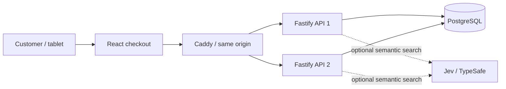

# Architecture

One modular application, independently testable at the HTTP/database boundary.



`src/client` owns presentation and saved purchase intent. `src/shared` owns strict schemas and types. `src/server` owns catalog, sessions, transactional orders and HTTP. Optional discovery calls Jev with query/catalog data only. No external payment service is called. See [visitor identity](visitor-identity.md) and [Jev discovery](jev-discovery.md) for the expanded boundaries.

## Transaction boundary

```mermaid
sequenceDiagram
  participant UI as Browser
  participant API
  participant DB as PostgreSQL
  UI->>UI: Persist intent + idempotency key
  UI->>API: POST order with session token
  API->>DB: Begin; lock customer session
  API->>DB: Find prior order / compare request hash
  alt Existing matching intent
    DB-->>API: Original receipt
  else New intent
    API->>DB: Validate menu, prices, quantities
    API->>DB: Insert order + immutable item snapshots
    API->>DB: Commit
  end
  API-->>UI: Confirmed receipt
  Note over UI,API: If the response is lost, replay the exact saved intent.
```

Session row locking serializes purchases for the same customer across processes. A unique session constraint is a second database guarantee. This permits concurrency across different customers while ensuring only one purchase per session. The request hash uses canonical item order and merged quantities, payment method and reviewed menu revision.

Readiness checks the database. Process liveness is independent of database readiness. Admission limits are persisted, so starting another API process cannot multiply a visitor's allocation.

The browser keeps a bearer session token and unfinished intent in sessionStorage. The database stores only the token's SHA-256 hash. Strict JSON validation, same-origin HTTP, CSP and secret redaction reduce exposure. There are no customer accounts or payment details.

## Deliberate limits

A single database/VM remains a shared failure point. Session storage is scoped to a tab and can be unavailable in restricted browsers; submission must not proceed unless recovery state can be saved. Session expiry limits the recovery window to 24 hours. No claim of million-order capacity is made.
