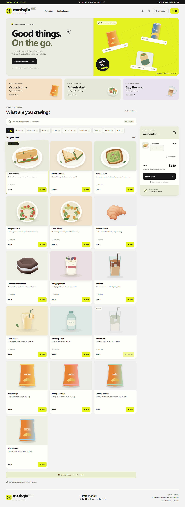

# Verification evidence

## Most recent recorded checks

| Date and scope                               | Result                                                                                                                                                                      | Record                                                           |
| -------------------------------------------- | --------------------------------------------------------------------------------------------------------------------------------------------------------------------------- | ---------------------------------------------------------------- |
| 2026-09-22: frontend publication preparation | Full local verification passed: 15 unit and 31 PostgreSQL integration tests, format, architecture, contract, types and builds. The separate static `build:web` also passed. | [Publication preparation](evidence/publication-preparation.json) |
| 2026-09-22: Oracle release                   | Two ARM64 API replicas, health checks, create/replay/conflict checks and preserved database rollback material.                                                              | [Actual deployment](deployment-current.md)                       |
| 2026-09-22: remote browser and bounded load  | Same receipt recovered after a lost response; 87/87 purchases at an offered 80/min for 65 seconds; SQL independently matched receipts.                                      | [Remote evidence](evidence/remote/README.md)                     |

Vercel configuration is prepared; no Vercel deployment is recorded. The browser/accessibility and live Jev checks below belong to the earlier dated run and were not rerun during publication preparation. The Oracle release has Jev disabled; the local live-provider result does not claim that the public API has a provider key.

## Historical brand and discovery verification — 2026-09-21

Recorded on 2026-09-21 for the brand, open artwork, vapor, sound and press/SEO update.

**62 automated tests passed:** 15 unit/contract/state tests, 27 real-PostgreSQL integration tests and 20 Chromium browser tests. The separate two-API Compose experiment also passed. A subsequent post-reboot live check passed all seven Jev scenarios and verified selection in the browser. The earlier HTTP 401 record is preserved as historical evidence.

| Check                               | Observed result                                                                                                                                                                                                                                                    |
| ----------------------------------- | ------------------------------------------------------------------------------------------------------------------------------------------------------------------------------------------------------------------------------------------------------------------ |
| `npm run verify`                    | All eight stages passed: formatting, architecture/spec references, OpenAPI drift, types, unit tests, integration tests and both builds.                                                                                                                            |
| Unit/contract/state                 | 15 passed, including strict inputs, integer money, saved intent, full 40-item cart storage, local ranking and typed Jev response validation.                                                                                                                       |
| PostgreSQL integration              | 27 passed, including concurrent idempotency, visitor ownership, history pagination, revocation, UUID forgery rejection, catalog expansion, shared Jev cache/leases/quotas and provider-failure handling. Provider responses in these tests are controlled doubles. |
| Browser against final Compose build | 20 passed; no skips, retries, unexpected failures or flaky results. Includes history after reload, device reset, asynchronous search, stale response rejection and checkout while AI is unavailable.                                                               |
| Lost response                       | Integration destroys the socket after commit; browser testing retrieves a real 201 before suppressing its delivery. Both recover the original order.                                                                                                               |
| Accessibility                       | Selected axe WCAG 2 A/AA and 2.1 AA rules passed on menu, review, receipt, history and autocomplete after observed contrast and keyboard issues were corrected.                                                                                                    |
| Layout                              | 1440, 768 and 390px captures; no horizontal overflow, missing artwork or page JavaScript errors in the checked scenarios. Reduced-motion behavior tested.                                                                                                          |
| Two-container correctness           | 20 identical simultaneous attempts: one creation and 19 replays, with responses from `api-1` and `api-2`. Changed intent conflicted.                                                                                                                               |
| API restart                         | Restarted both APIs and recovered the same receipt from persistent PostgreSQL.                                                                                                                                                                                     |
| Linux packaging                     | Final source built and ran in healthy Linux amd64 containers on Docker Desktop.                                                                                                                                                                                    |
| Brand and feedback                  | Warm-card overflow and reduced motion passed. Real Web Audio oscillator scheduling distinguished categories; mute survived reload; an unavailable audio device did not block cart changes.                                                                         |
| Press and SEO                       | ZIP download, image responses, local noindex and 404 behavior passed. Actual built HTML used configured HTTPS canonical/social URLs even with an unrelated Host header.                                                                                            |
| Open artwork                        | 20 Kenney CC0 models rendered as static PNGs, plus eight original drink SVGs. Source license and hashes are retained. Three.js is absent from runtime dependencies.                                                                                                |
| Live Jev evaluation                 | Seven real provider calls passed: exact product, semantic snack search, sugar-free cola, hot chicken lunch, Portuguese search and two unrelated/adversarial requests. The browser displayed real cached suggestions and added Sea salt chips to the cart.          |

The 20 concurrent requests are a correctness experiment, not a throughput or capacity benchmark. Mocked suggestion tests establish application behavior, not actual model quality.

## Reproduce

```sh
npm ci --ignore-scripts
npm run db:up
npm run verify
npx playwright install chromium
npm run test:e2e
docker compose up --build -d --wait
node scripts/demo-check.mjs --restart
```

The final browser run targeted `BASE_URL=http://127.0.0.1:8090` with PowerShell environment configuration. The default browser command starts its own server against the disposable test database.

An optional, explicitly live evaluation uses `npm run test:jev:live`. After updating the root `.env`, recreate the API containers so the process receives the new key. This command sends fictional search queries to TypeSafe; ordinary tests never require a key.

## Evidence and provenance

[Compact results](evidence/latest.json) record the 2026-09-21 verification, browser, Compose, artwork and publication checks. [Live evaluation output](evidence/jev-live.json) records the successful real-provider run without secrets. The [previous credential failure](evidence/jev-auth-failure.json) is retained separately. The [initial checkout evidence](evidence/checkout-v1.json) and [visitor/discovery evidence](evidence/market-v1.1.json) are preserved separately.

Full local outputs are generated under ignored `artifacts/`: verification, traceability, browser results, Compose observations, live evaluation and screenshots. The harness found **35 specification IDs and 76 test references**. These references are links, not proof of exhaustive coverage.

Source fingerprint: `5dd928b4e19057a202ebbcade71006edab6ec359bb27c2a9975c1571b77cf2f9`. Verification and final Compose checks share this fingerprint. The successful live Jev evaluation also uses this fingerprint; the earlier credential failure belongs to the previous release. It covers source, tests, scripts, assets, migrations and selected build configuration, excluding prose documentation and generated artifacts.

Host: Windows with Node 24.18.0. Containers: Linux amd64. Browser: Playwright Chromium. Database: PostgreSQL 17 in dedicated local containers.

## Visual review

Desktop, narrow-screen, review, receipt, history and search were captured through the browser harness and visually reviewed. The PNGs are unchanged browser captures.



[Tablet](images/checkout-tablet.png) · [Review](images/review.png) · [Receipt](images/receipt.png) · [Visitor history](images/market-history.png)

[Coffee variations](images/coffee-variations.png) · [Vapor above warm cards](images/warm-cards.png) · [Press kit](images/press-kit.png)

The retained older autocomplete illustration uses a controlled provider response. The new [live Jev capture](images/jev-live-search.png) shows the actual provider result for the Portuguese query, retrieved from its successful cache entry with no provider mock.

## Not established by the 2026-09-21 run

- Seven smoke cases do not establish calibrated model relevance, broad multilingual performance or adversarial robustness.
- Public-domain deployment, search-engine indexing and subjective loudness on the user’s speakers were not tested.
- Remote CI, independent review, backup restore, maximum load capacity or host-level high availability. Oracle deployment, ARM64 execution and a bounded remote load run were established later; see the 2026-09-22 records above.
- Complete accessibility compliance from the selected automated checks.
- Real financial settlement: all payments and products are fictional.

See the [build log](ai/build-log.md), [Jev design](jev-discovery.md) and [operations](operations.md) for decisions, reproducibility and limits.

## 2026-09-23 UTC — Structure and experience update

Current delivery checks: **15 unit + 32 PostgreSQL integration + 22 Chromium
browser scenarios passed**, including a real Web Audio signal measurement,
persistent volume, moving decoration with stationary targets, reduced motion,
checkout recovery and visitor history. The Vercel static build also passed.
[Delivery record](evidence/structure-experience.json).

The newly executed [public game/API experiments](evidence/live-game/README.md)
separately establish 35 game receipts and a 60-second 1,280-purchase API sample.
They do not reuse the historical SQL result as verification of the new IDs.
The [public checkout origin check](evidence/live-game/checkout-origin.json) records
a remaining 403 on visitor creation; no remote origin change is claimed.
