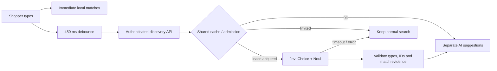

# Jev discovery: meaningful suggestions without a generated shopping cart

The shopper types a product name or describes a craving. Exact autocomplete runs locally immediately. After a 450 ms pause, an independent request asks Jev for semantic matches. The customer still chooses what to buy.

## Decisions, not generated products

The adapter sends two typed questions in one request to `https://api.typesafe.ai/v1/systemone`:

- **Choice** ranks the available catalog IDs, plus an explicit `none` option.
- **Noul** checks whether the catalog actually contains a relevant answer.

A high relative ranking alone is insufficient: something always ranks first even for unrelated requests. The application requires match evidence of at least 0.7, validates returned types and IDs, removes unavailable products and displays at most three suggestions. Choice weights sum to one; they are relative ranking weights, not independent probabilities that each product satisfies the request. Confidence is preserved as diagnostic evidence, not displayed as a promise to the shopper.

This is adapted from TypeSafe's [semantic-find cookbook](https://docs.typesafe.ai/cookbooks/semantic_find), [Choice primitive](https://docs.typesafe.ai/primitives/choice) and [confidence guidance](https://docs.typesafe.ai/confidence). The initial 0.7 threshold is a conservative policy choice, not a calibrated accuracy claim. The [live smoke evaluation](../scripts/jev-eval.mjs) distinguishes model results from mocked tests.

## Request and privacy boundary

Only the search text and fictional available catalog descriptions/prices are sent. Visitor UUIDs, cookies, session tokens, receipts and order history are excluded. The search UI explains this transfer. The provider key is read only on the server and is not included in the client build or Git.

Input text is untrusted data. The model has no tools, database access or purchasing authority. Closed-set validation constrains what the UI can display; the ordinary checkout continues to validate prices and quantities transactionally.

## Failure and cost behavior



- Fixed model: `jev-1.13.0`; policy version: `market-find-v1`.
- Maximum query: 120 characters. Maximum request: 32 KB. Maximum available catalog: 254 products plus `none`.
- Four-second provider timeout by default; no automatic paid retries.
- PostgreSQL cache keyed by normalized query, menu revision, policy and model; six-hour successful-result TTL.
- A 15-second lease coalesces concurrent identical requests across APIs. Other callers get a typed `pending` fallback.
- Shared admission: 100 provider attempts per UTC-day bucket by default, configurable with `TYPESAFE_MAX_CALLS_PER_DAY`; 60 discovery requests per visitor/hour.
- Failed results have a short 30-second cache. HTTP 401/403 opens a shared five-minute credential cooldown. A changed key uses a different cooldown identity.
- Status, model version, duration and token counts are recorded in `discovery_usage`. Search text and credentials are not logged there.
- Missing key, low match evidence, bad response, quota or provider outage never disables ordinary search or checkout.

Official pricing checked on 2026-09-21: $0.042 per million input tokens; output tokens free. This is the [TypeSafe model rate](https://docs.typesafe.ai/models), not an infrastructure estimate or a promise that pricing remains unchanged. The evaluator estimates cost from reported usage and marks unknown usage appropriately.

## Run and review

Put `TYPESAFE_API_KEY` in the ignored root `.env`, then recreate the local API containers:

```sh
docker compose up --build -d --wait
npm run test:jev:live
```

The live command explicitly sends seven fictional queries and writes `artifacts/jev-live-evaluation.json`. Ordinary unit, integration and browser tests do not require a provider key and exercise controlled responses. Do not present their mocked ranking examples as observed model quality.

Implementation: [adapter](../src/server/jev.ts), [shared cache/admission](../src/server/discovery.ts), [autocomplete](../src/client/SearchBox.tsx). Operational HTTP-status telemetry distinguishes credential problems from invalid responses without exposing a key.

## Observed live result — 2026-09-21

After the user repaired the credential, restarted the Compose application and ran the seven-case live evaluator: all seven cases passed against Jev 1.13.0. Positive queries returned known catalog IDs, the Portuguese request selected snacks, and both unrelated/adversarial requests returned no-match. Requests took 303–887 ms in this single local run; these are observations, not a latency guarantee.

The provider reported 46,086 input tokens over seven upstream attempts. At the previously documented rate, the script estimates approximately USD 0.00194; this is not a bill. A subsequent browser check used the real cached Portuguese response, selected Sea salt chips and added one unit, with no page errors and no provider mock.

[Successful raw report](evidence/jev-live.json) · [Earlier authentication failure](evidence/jev-auth-failure.json) · [Live UI capture](images/jev-live-search.png)
