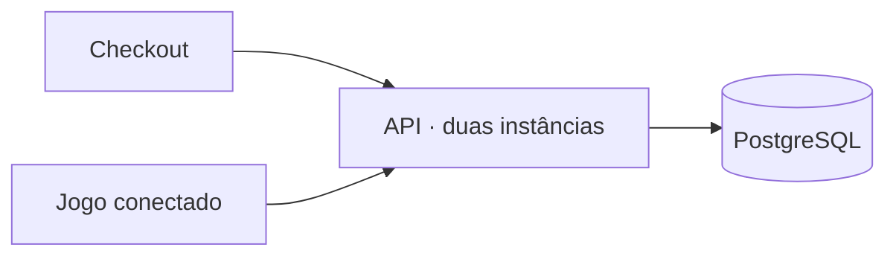

# Vídeo curto — checkout + jogo + API real

**Duração: aproximadamente 80 segundos.** Fale naturalmente e grave cada bloco separado.
**Mensagem central:** uma arquitetura simples, com decisões de consistência e infraestrutura, atendendo um fluxo real medido.

## Roteiro: fala e imagem juntas

| Tempo       | O que falar                                                                                                                                                                                         | O que mostrar                                                                                                                                                        |
| ----------- | --------------------------------------------------------------------------------------------------------------------------------------------------------------------------------------------------- | -------------------------------------------------------------------------------------------------------------------------------------------------------------------- |
| **0–8 s**   | “Criei um checkout de autoatendimento: a pessoa escolhe os produtos, revisa a compra e recebe a confirmação, sem precisar de um caixa.”                                                             | **Vídeo do checkout:** adicionar um produto → revisar → mostrar o recibo. Use cortes para encurtar os cliques.                                                       |
| **8–19 s**  | “Escolhi um backend modular com PostgreSQL. O servidor calcula os preços, confirma depois de salvar e permite repetir uma tentativa sem duplicar o pedido.”                                         | **Diagrama simples** por 4 segundos; depois, um close no recibo. Texto curto: “Preço no servidor · Compra persistida · Repetição segura”.                            |
| **19–31 s** | “Para explorar outro caso de uso, fiz um jogo estilo tycoon. Você começa com uma pequena loja, frutas e caixas tradicionais, atendendo os primeiros clientes.”                                      | **Vídeo de um jogo novo:** visão geral, um cliente pegando fruta e chegando ao caixa. Evite passar pelo tutorial inteiro.                                            |
| **31–43 s** | “O objetivo é reinvestir as vendas: abrir departamentos, contratar funcionários, melhorar os caixas e expandir até quatro lojas, aumentando o movimento.”                                           | **Montagem de progressão:** um upgrade → loja movimentada → visão de várias lojas. Legenda: “Início → Expansão”. Use um save avançado separado.                      |
| **43–55 s** | “No modo conectado, essas compras enviam requisições à mesma API do checkout. O cliente espera um recibo real, e o jogo só então contabiliza a venda.”                                              | **Vídeo do modo Live checkout API**, seguido do painel de chamadas. Destaque um status 201, o recibo e o saldo aumentando.                                           |
| **55–69 s** | “Em uma medição separada na API pública, confirmamos 1.280 compras em 60 segundos, sem erros. Todos os recibos foram consultados novamente, e o p95 ficou em 99 milissegundos.”                     | **Cartela estática legível:** “1.280 compras / 60 s”, “0 erros”, “p95: 99 ms”. Rodapé: “Sessão + pedido; teste sintético na API pública”. Não mostre o JSON inteiro. |
| **69–80 s** | “Duas instâncias da API compartilham o banco. O resultado mostra que um backend simples, com consistência e infraestrutura bem pensadas, atende esse fluxo sem precisar começar com microserviços.” | **Retome o diagrama**, depois encerre no jogo movimentado com os links do checkout e do jogo.                                                                        |

## Diagrama para a cena de arquitetura

Mostre o diagrama pronto; não grave você digitando Mermaid.

Ele mostra dois clientes usando a mesma aplicação. As instâncias compartilham o
banco; não são dois backends de negócio diferentes.

## Prepare somente cinco tomadas

1. **Compra no checkout:** do produto ao recibo.
2. **Jogo no início:** primeiras frutas, poucos clientes e caixa tradicional.
3. **Jogo avançado:** departamentos, filas e mais lojas. Use um save separado;
   não apague seu progresso principal. Se usar capturas existentes, deixe claro
   que são imagens de outro estágio da demonstração.
4. **Jogo conectado:** selo Live checkout API e uma compra no painel sanitizado.
5. **Duas cartelas:** diagrama e números do teste.

Prefira vídeo para mostrar comportamento; imagem estática para arquitetura e
números. Se não tiver vídeo do estágio avançado, uma foto por dois segundos com
um zoom discreto resolve. Uma transição entre início e expansão basta.

## Como deixar convincente sem carregar de informação

- Grave a voz em blocos. Monte as imagens por cima depois.
- Não narre os cliques: explique a decisão ou o resultado enquanto a ação aparece.
- Mostre a evolução do jogo com cortes; não espere os desbloqueios durante o vídeo.
- Deixe cada número principal visível por pelo menos três segundos.
- Use legendas curtas. A cartela não precisa repetir toda a fala.
- Mantenha a música abaixo da voz. Se demonstrar o som do carrinho, reserve um
  instante sem fala, em vez de competir com a narração.

## Precisão da mensagem sobre escala

A frase forte é **“atendeu esse fluxo medido com uma arquitetura simples”**.
O teste de 60 segundos não demonstrou capacidade máxima, elasticidade automática
ou alta disponibilidade. As duas APIs e o banco ainda compartilham um host.

O jogo demonstra a integração. O medidor separado demonstra a taxa de compras.
Acelerar a simulação ou mostrar quatro lojas não mede, por si só, throughput HTTP.
No teste, cada compra gerou dois POSTs: **2.560 requisições de escrita**, cerca de
**42,6 por segundo**. As leituras de confirmação vieram depois.

“p95: 99 ms” corresponde à criação da sessão mais a confirmação do pedido, sem
incluir a leitura posterior. Para um público menos técnico, substitua a fala por
“95% das compras foram confirmadas em aproximadamente um décimo de segundo”.

Os pedidos são reais **no banco da demonstração**; pagamento, valores e tempos dos
equipamentos do jogo são fictícios. O jogo não executa visão computacional real.

[Resultados e método](evidence/live-game/README.md).

## Antes de gravar

- O jogo começa offline. Selecione **Settings → Live checkout API**, configure
  `https://api.megamashgin.top` e ative o purchase trace.
- Faça uma compra de ensaio. O checkout público apresentou 403 na criação de
  visitante; o ajuste remoto continua dependente de acesso SSH válido.
- As mudanças visuais recentes permanecem em commits locais, sem push. Até a
  publicação, grave essa versão local e identifique-a como demonstração local.
- Mostre apenas o painel sanitizado de chamadas, sem tokens, cookies ou `.env`.

## Se precisar de exatamente 60 segundos

Retire a cena de 8–19 s e encurte o encerramento para:

> “Duas instâncias da mesma API, um banco e um fluxo medido: simplicidade com decisões de engenharia.”

Use o diagrama por cima desse encerramento. Preserve a evolução do jogo e a prova
real: são o centro desta apresentação.
